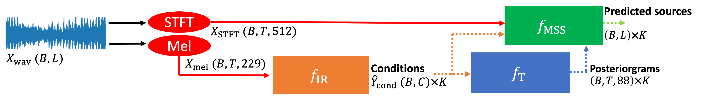

# Table of Contents
- [Table of Contents](#table-of-contents)
- [Jointist](#jointist)
  - [Setup](#setup)
  - [Inference](#inference)
    - [a. Instrument Recognition + Transcription](#a-instrument-recognition--transcription)
    - [b. Instrument Recognition + Transcription + Source Separation](#b-instrument-recognition--transcription--source-separation)
  - [Using individual pretrained models](#using-individual-pretrained-models)
    - [Transcription](#transcription)
  - [Training](#training)
    - [Instrument Recognition](#instrument-recognition)
    - [Transcrpition](#transcrpition)
    - [End2end training (Jointist)](#end2end-training-jointist)
  - [Experiments](#experiments)


# Jointist

Jointist is a joint-training framework capable of:
1. Instrument Recogition
1. Multi-Instrument Transcription
1. Music Source Separation



Demo: [https://jointist.github.io/Demo/](https://jointist.github.io/Demo/)

Paper: [https://arxiv.org/abs/2302.00286](https://arxiv.org/abs/2302.00286)


## Setup
This code is developed using the docker image `nvidia/cuda:10.2-devel-ubuntu18.04` and python version 3.8.10.

To setup the environment for joinist, install the dependies
```bash
pip install -r requirements.txt
```

If you get `OSError: sndfile library not found`, you need to install `libsndfile1` using

```bash
apt install libsndfile1
```

<!-- It will download model weights, demo songs, and Anaconda, and then install the required dependencies into a jointist environment.

The model weights and demo songs are located in `weights` and `songs` folder respectively. -->

The pretrained **model weights** can be download from [dropbox](https://www.dropbox.com/s/n0eerriphw65qsr/jointist_weights.zip?dl=0). Put the model weights under the `weights` folder after downloading.

The example **songs** for interference is included in this repo as `songs.zip`.

After unzipping it using the following command, a new folder called `songs` will be created.

```bash
unzip songs.zip
```

## Inference
### a. Instrument Recognition + Transcription
The following script detects the instrument in the song and transcribe the instruments detected:
```bash
python pred_jointist.py audio_path=songs audio_ext=mp3 gpus=[0]
```

It will first run a instrument recognition model, and the predicted instruments are used as the conditions to the transcription model.

If you have multiple GPUs, the argument `gpus` controls which GPU to use. For example, if you want to use GPU:2, then you can do `gpus=[2]`.

The `audio_path` specifies the path to the input audio files. If your audio files are not in `.mp3` format, you can change the `audio_ext` argument to the audio format of your songs. Since we use `torchaudio.load` to load audio files, you can used any audio format as long as it is supported by torchaudio.load.

The output MIDI files will be stored inside the `outputs/YYYY-MM-DD/HH-MM-SS/MIDI_output` folder.

Model weights can be changed under `checkpoint` of `End2End/config/jointist_inference.yaml`. 

- `transcription1000.ckpt` is the model trained only on the transcription task.
- `tseparation.ckpt` is the model weight jointly trained with both transcription and source separation tasks. 

### b. Instrument Recognition + Transcription + Source Separation

The following inference script performs instrument detection, transcription, and source separation:

```bash
python pred_jointist_ss.py audio_path=songs audio_ext=mp3 gpus=[0]
```

Same as above, the output MIDI files will be stored inside the `outputs/YYYY-MM-DD/HH-MM-SS/MIDI_output` folder.

Model weights can be changed under `checkpoint` of `End2End/config/jointist_ss_inference.yaml`. `tseparation.ckpt` is the checkpoint with a better transcription F1 sources and source separation SDR after training both of them end2end.

Implementational details for Jointist is avaliable [here](./jointist_explanation.md)


## Using individual pretrained models
### Transcription
```
python pred_transcription.py datamodule=wild
```

Currently supported `datamodule`:
1. wild
1. h5
1. slakh
The configuration such as `path` and `audio_ext` for each datamodule can be modified inside `End2End/config/datamoudle/xxx.yaml`

## Training

### Instrument Recognition

```bash
python train_detection.py detection=CombinedModel_NewCLSv2 datamodule=slakh epoch=50 gpus=4 every_n_epochs=2  
```

`detection`: controls the model type
`detection/backbone`: controls which CNN backbone to use
`datamodule`: controls which dataset to use `(openmic2018/slakh)`. It affects the instrument mappings.

Please refer to `End2End/config/detection_config.yaml` for more configuration parameters

### Transcrpition

```bash
python train_transcription.py transcription.backend.acoustic.type=CNN8Dropout_Wide inst_sampler.mode=imbalance inst_sampler.samples=2 inst_sampler.neg_samples=2 inst_sampler.temp=0.5 inst_sampler.audio_noise=0 gpus=[0] batch_size=2
```

`transcription.backend.acoustic.type`: controls the model type
`inst_sampler.mode=imbalance`: controls which sampling mode to use
`inst_sampler.samples`: controls how many positive samples to be mined for training
`inst_sampler.neg_samples`: controls how many negative samples to be mined for training
`inst_sampler.temp`: sampling temperature, only effective when using imbalance sampling
`inst_sampler.audio_noise`: controls if random noise should be added to the audio during training
`gpus`: controls which gpus to use. `[0]` means using cuda:0; `[2]` means using cuda:2; `[0,1,2,3]` means using four gpus cuda:0-3

Please refer to `End2End/config/transcription_config.yaml` for more configuration parameters

### End2end training (Jointist)

```
python train_jointist.py
```


## Experiments
[link](./experiments.md)