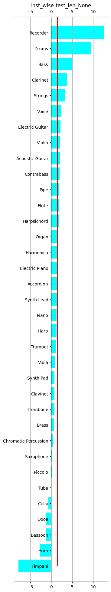
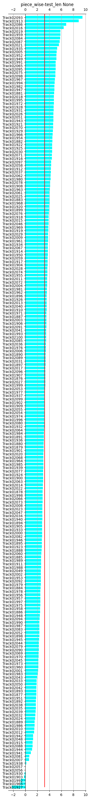

# Key Results
## The effect of end2end training on:
### MSS
|                              |     Full lenght SDR    |              |               |     10s SDR    |              |               |
|:----------------------------:|:----------------------:|:------------:|:-------------:|:--------------:|:------------:|:-------------:|
|             Model            |           inst         |     piece    |     source    |       inst     |     piece    |     source    |
|      Separation (S) only     |           1.52         |      3.24    |      3.03     |       3.18     |      5.01    |      4.13     |
|     Transcription (T) + S    |           1.74         |      3.46    |      3.24     |       3.50     |      5.28    |      4.42     |
|       Ground Truth T + S     |           4.06         |      4.96    |      4.81     |       4.87     |      6.63    |      5.72     |

## Transcription

|                                    |     Flat F1    |              |                    |     Piecewise F1    |              |                    |     Instrumentwise F1    |              |                    |
|:----------------------------------:|:--------------:|:------------:|:------------------:|:-------------------:|:------------:|:------------------:|:------------------------:|:------------:|:------------------:|
|                Model               |      frame     |      note    |     note_offset    |         frame       |      note    |     note_offset    |           frame          |      note    |     note_offset    |
|                T only              |      0.724     |     0.545    |        0.221       |         0.490       |     0.544    |        0.230       |           0.371          |     0.395    |        0.168       |
|     pretrained   T+ S (ongoing)    |      0.740     |     0.562    |        0.237       |         0.524       |     0.579    |        0.253       |           0.422          |     0.455    |        0.203       |

## Detail Records
### Instrument Recognition
|                     |                                            |     F1       |              |                |     mAP      |              |                |
|---------------------|--------------------------------------------|--------------|--------------|----------------|--------------|--------------|----------------|
|     Backbone        |     Model                                  |     macro    |     micro    |     samples    |     macro    |     micro    |     samples    |
|     CNN14           |     meanmax                                |     0.607    |     0.843    |     0.835      |     0.740    |     0.917    |     0.928      |
|                     |     tT-E0D1   S (256 CXF)                  |     0.625    |     0.852    |     0.847      |     0.711    |     0.910    |     0.923      |
|                     |     AR-T E0D1 SoMax                        |     0.623    |     0.834    |     0.825      |     -        |     -        |     -          |
|                     |     MTT E1                                 |     0.580    |     0.852    |     0.851      |     0.684    |     0.914    |     0.922      |
|     CNN8            |     mean   max                             |     0.401    |     0.794    |     0.790      |     0.536    |     0.864    |     0.886      |
|                     |     tT-E0D1   S (256 CXF)                  |     0.556    |     0.827    |     0.819      |     0.684    |     0.903    |     0.910      |
|                     |     AR-T E0D1 SoMax                        |     0.568    |     0.798    |     0.795      |     -        |     -        |     -          |
|                     |     MTT E1                                 |     0.557    |     0.822    |     0.813      |     0.660    |     0.898    |     0.912      |
|     AcousticCNN8    |     mean   max                             |     0.369    |     0.764    |     0.762      |     0.468    |     0.845    |     0.874      |
|                     |     T-E0D1 S (256 CXF)                     |     0.546    |     0.801    |     0.794      |     0.621    |     0.879    |     0.893      |
|                     |     AR-T E0D1 SoMax      (DGX)             |     0.603    |     0.808    |     0.808      |       -      | -            | -              |
|                     |     MTT E1                                 |     N.A      |     N.A      |     N.A        |     N.A      |     N.A      |     N.A        |
|     ResNet50        |     mean max                               |     0.127    |     0.472    |     0.457      |     0.137    |     0.289    |     0.316      |
|                     |     tT-E0D1 S (256 CXF)                    |     0.069    |     0.466    |     0.453      |     0.136    |     0.498    |     0.627      |
|                     |     AR-T E0D1 SoMax                        |     0.126    |     0.573    |     0.555      | N.A.         | N.A.         | N.A.           |
|                     |     MTT E1                                 |     0.093    |     0.523    |     0.503      |     0.154    |     0.504    |     0.627      |
|     ResNet101       |     mean max                               |     0.153    |     0.253    |     0.245      |     0.139    |     0.152    |     0.164      |
|                     |     tT-E0D1 S (25tT-E0D1   S 6 CXF)        |     0.124    |     0.455    |     0.426      |              |              |                |
|                     |     AR-T E0D1 SoMax                        |     0.383    |     0.689    |     0.688      |     -        |     -        |     -          |
|                     |     MTT E1                                 |     0.089    |     0.522    |     0.503      |     0.136    |     0.496    |     0.624      |

## Transcription

### Different mining parameters
t: temperature
b: batch size
s: number of samples

|                                   |     Instrumentwise F1    |              |                    |
|:---------------------------------:|:------------------------:|:------------:|:------------------:|
|                Model              |           frame          |      note    |     note_offset    |
|          random; s=1, b=4         |           0.357          |     0.380    |        0.171       |
|          random; s=3, b=4         |           0.398          |     0.412    |        0.198       |
|     imbalance; s=1, b=4, t=0.3    |           0.368          |     0.407    |        0.187       |
|     imbalance; s=1, b=4, t=0.5    |           0.366          |     0.407    |        0.182       |
|     imbalance; s=1, b=4, t=0.9    |           0.378          |     0.414    |        0.185       |
|     imbalance; s=3, b=4, t=0.3    |           0.419          |     0.443    |        0.214       |
|     imbalance; s=3, b=4, t=0.5    |           0.447          |     0.464    |        0.243       |
|     imbalance; s=3, b=4, t=0.9    |           0.428          |     0.463    |        0.231       |

### Different training strategries

|                                      |     Flat F1    |              |                    |     Piecewise F1    |              |                    |     Instrumentwise F1    |              |                    |
|:------------------------------------:|:--------------:|:------------:|:------------------:|:-------------------:|:------------:|:------------------:|:------------------------:|:------------:|:------------------:|
|                 Model                |      frame     |      note    |     note_offset    |         frame       |      note    |     note_offset    |           frame          |      note    |     note_offset    |
|          Jointist (Original)         |      0.720     |     0.538    |        0.217       |         0.489       |     0.505    |        0.223       |           0.357          |     0.384    |        0.169       |
|      Jointist (Original 3p1n im)     |      0.745     |     0.554    |        0.242       |         0.533       |     0.540    |        0.261       |           0.426          |     0.442    |        0.225       |
|      Jointist (Original 3p3n im)     |      0.727     |     0.546    |        0.219       |         0.514       |     0.530    |        0.236       |           0.400          |     0.422    |        0.193       |
|     Jointist (Original 3p3n rand)    |      0.744     |     0.561    |        0.239       |         0.529       |     0.544    |        0.248       |           0.390          |     0.414    |        0.189       |
|     Jointist (Original 3p1n rand)    |      0.725     |     0.546    |        0.221       |         0.490       |     0.545    |        0.230       |           0.372          |     0.396    |        0.167       |
|       Jointist (Wide + 3p1n im)      |      0.735     |     0.569    |        0.235       |         0.510       |     0.580    |        0.246       |           0.418          |     0.472    |        0.216       |
|       Jointist (Wide + 2p2n im)      |      0.738     |     0.563    |        0.236       |         0.530       |     0.558    |        0.253       |           0.430          |     0.466    |        0.217       |
|         Semantic Segmentation        |      0.714     |     0.285    |        0.138       |         0.340       |     0.126    |        0.062       |           0.308          |     0.112    |         0.05       |

### Source Separation
|                    |                                     |     Full lenght SDR    |              |               |     10s SDR    |              |               |
|:------------------:|:-----------------------------------:|:----------------------:|:------------:|:-------------:|:--------------:|:------------:|:-------------:|
|      Roll Merge    |              Model                  |           inst         |     piece    |     source    |       inst     |     piece    |     source    |
|      Wrong Sum     |             End2End 3p0n            |           1.74         |      3.42    |      3.20     |       3.22     |      5.19    |      4.37     |
|                    |     End2End 3p0n     (posterior)    |           1.79         |      3.46    |      3.24     |       3.35     |      5.30    |      4.43     |
|                    |              preEnd2End             |           0.38         |      2.72    |      2.41     |       1.91     |      3.60    |      3.39     |
|                    |      preEnd2End     (posterior)     |           1.91         |      3.61    |      3.40     |       3.58     |      5.52    |      4.65     |
|                    |               STE 3p0n              |           1.74         |      3.46    |      3.24     |       3.50     |      5.28    |      4.42     |
|                    |         STE 3p0n (posterior)        |           1.94         |      3.48    |      3.27     |       3.48     |      5.15    |      4.30     |
|                    |            preTS_STE 3p0n           |           1.71         |      3.47    |      3.23     |       3.28     |      5.40    |      4.53     |
|                    |      preTS_STE 3p0n (posterior)     |           2.01         |      3.58    |      3.38     |       3.57     |      5.30    |      4.48     |
|     Correct Sum    |             End2End 3p0n            |           1.35         |      3.22    |      2.97     |       3.14     |      5.32    |      4.31     |
|                    |     End2End 3p0n     (posterior)    |           1.86         |      3.55    |      3.32     |       3.47     |      5.60    |      4.54     |
|                    |              preEnd2End             |           0.20         |      2.75    |      2.44     |       1.86     |      5.34    |      4.11     |
|                    |      preEnd2End     (posterior)     |           2.01         |      3.72    |      3.50     |       3.69     |      5.86    |      4.81     |
|                    |               STE 3p0n              |           1.30         |      3.30    |      3.06     |       2.40     |      5.13    |      4.16     |
|                    |         STE 3p0n (posterior)        |           1.45         |      3.31    |      3.10     |       2.41     |      4.96    |      4.07     |
|                    |            preTS_STE 3p0n           |                        |              |               |                |              |               |
|                    |      preTS_STE 3p0n (posterior)     |                        |              |               |                |              |               |
|        Concat      |             End2End 3p0n            |                        |              |               |                |              |               |
|                    |     End2End 3p0n     (posterior)    |                        |              |               |                |              |               |
|                    |              preEnd2End             |          -0.04         |      2.63    |      2.31     |       1.86     |      5.44    |      4.09     |
|                    |      preEnd2End     (posterior)     |           1.92         |      3.75    |      3.52     |       3.50     |      6.03    |      4.90     |
|                    |               STE 3p0n              |                        |              |               |                |              |               |
|                    |         STE 3p0n (posterior)        |                        |              |               |                |              |               |
|                    |            preTS_STE 3p0n           |           1.72         |      3.47    |      3.22     |       3.18     |      5.78    |      4.61     |
|                    |      preTS_STE 3p0n (posterior)     |           2.13         |      3.66    |      3.46     |       1.86     |      5.44    |      4.09     |

# Evaluation Metrics

